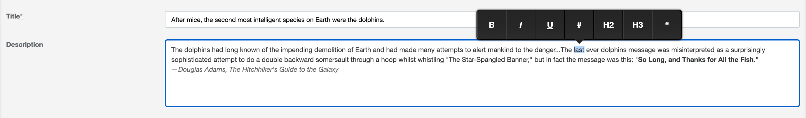

# PROJECT UNMAINTAINED

> *This project is not maintained anymore*
>
> *If you like it or continue to use it fork it please.*

---

# Active Admin Medium Editor
[](https://badge.fury.io/rb/activeadmin_medium_editor)
[](https://rubygems.org/gems/activeadmin_medium_editor)
[](https://github.com/blocknotes/activeadmin_medium_editor/actions/workflows/linters.yml)
[](https://github.com/blocknotes/activeadmin_medium_editor/actions/workflows/specs_rails61.yml)
[](https://github.com/blocknotes/activeadmin_medium_editor/actions/workflows/specs_rails70.yml)

An Active Admin plugin to use [medium-editor](https://github.com/yabwe/medium-editor), a compact and clean WYSIWYG editor.

**IMPORTANT NOTICE**: while I like the Medium Editor idea of having floating buttons, it looks like that they are slow to release new stable versions. Some editor bugs are related to this problem unfortunately.



## Usage

- After the installation, select some text in the editor
- A pop-up menu is shown with the available buttons
- Click on a button and the effect will be applied to the selected text

## Install

- After installing Active Admin, add to your Gemfile: `gem 'activeadmin_medium_editor'`
- Add also a SASS/SCSS gem to your Gemfile (ex. `gem 'sassc'`)
- Add at the end of your Active Admin styles (_app/assets/stylesheets/active_admin.scss_):
```scss
@import 'activeadmin/medium_editor/medium_editor';
@import 'activeadmin/medium_editor_input';
@import 'activeadmin/medium_editor/themes/default'; // or another theme
```
- Add at the end of your Active Admin javascripts (_app/assets/javascripts/active_admin.js_):
```js
//= require activeadmin/medium_editor/medium_editor
//= require activeadmin/medium_editor_input
```
- Use the input with `as: :medium_editor` in Active Admin model conf
- **data-options**: permits to set *medium-editor* options directly - see [options list](https://github.com/yabwe/medium-editor#mediumeditor-options) (examples below)

> Why 2 separated scripts/styles? In this way you can include a different version of *medium-editor* if you like

> **UPDATE FROM VERSION < 0.2.8**: please change your _app/assets/stylesheets/active_admin.scss_ using the new import lines above

## Examples

### Basic usage

```ruby
# Active Admin post form conf:
  form do |f|
    f.inputs 'Post' do
      f.input :title
      f.input :description, as: :medium_editor, input_html: { data: { options: '{"spellcheck":false,"toolbar":{"buttons":["bold","italic","underline","anchor"]}}' } }
      f.input :published
    end
    f.actions
  end
```

### Buttons configuration

```ruby
toolbar = { buttons: %w[bold italic underline strikethrough subscript superscript anchor image quote pre orderedlist unorderedlist indent outdent justifyLeft justifyCenter justifyRight justifyFull h1 h2 h3 h4 h5 h6 removeFormat html] }
f.input :description, as: :medium_editor, input_html: { data: { options: { toolbar: toolbar } } }
```

For details about the buttons' effect please refer to medium-editor documentation.

## Changelog

The changelog is available [here](CHANGELOG.md).

## Do you like it? Star it!

If you use this component just star it. A developer is more motivated to improve a project when there is some interest. My other [Active Admin components](https://github.com/blocknotes?utf8=✓&tab=repositories&q=activeadmin&type=source).

Or consider offering me a coffee, it's a small thing but it is greatly appreciated: [about me](https://www.blocknot.es/about-me).

## Contributors

- [Mattia Roccoberton](https://blocknot.es): author
- The good guys that opened issues and pull requests from time to time

## License

The gem is available as open-source under the terms of the [MIT](LICENSE.txt).
