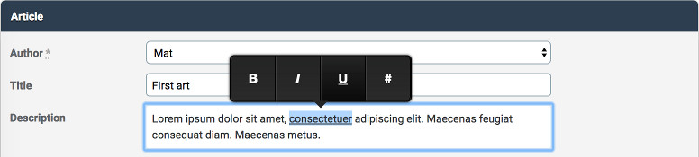

# ActiveAdmin Medium Editor [](https://badge.fury.io/rb/activeadmin_medium_editor)

An Active Admin plugin to use [medium-editor](https://github.com/yabwe/medium-editor), a compact and clean WYSIWYG editor.



*Usage*: select some text in the input, a pop-up menu is shown with the available buttons

## Install

- Add to your Gemfile:
`gem 'activeadmin_medium_editor'`
- Execute bundle
- Add at the end of your ActiveAdmin styles (_app/assets/stylesheets/active_admin.scss_):
```css
@import 'activeadmin/medium_editor_input';
@import 'activeadmin/medium_editor/themes/default.css'; // or another theme
```
- Add at the end of your ActiveAdmin javascripts (_app/assets/javascripts/active_admin.js_):
```js
//= require activeadmin/medium_editor/medium_editor
//= require activeadmin/medium_editor_input
```
- Use the input with `as: :medium_editor` in Active Admin model conf

Why 2 separated scripts? In this way you can include a different version of *medium-editor* if you like.

## Options

**data-options**: permits to set *medium-editor* options directly - see [options list](https://github.com/yabwe/medium-editor#mediumeditor-options)

## Examples

```ruby
# ActiveAdmin article form conf:
  form do |f|
    f.inputs 'Article' do
      f.input :title
      f.input :description, as: :medium_editor, input_html: { data: { options: '{"spellcheck":false,"toolbar":{"buttons":["bold","italic","underline","anchor"]}}' } }
      f.input :published
    end
    f.actions
  end
```

Some more buttons:

`f.input :description, as: :medium_editor, input_html: { data: { options: '{"spellcheck":false,"toolbar":{"buttons":["bold","italic","underline","anchor","orderedlist","unorderedlist","strikethrough","subscript","superscript","pre","h1","h2","h3","h4","h5","h6","html"]}}' } }`

## Notes

With the current version of Medium Editor some default buttons seem to not work properly, from my test they are: "indent", "outdent", "quote", "justifyLeft", "justifyCenter", "justifyRight", "justifyFull"

If some of this feature are needed I could suggest to override the button behavior or to use custom style classes. See the Medium Editor documentation for details.

## Do you like it? Star it!

If you use this component just star it. A developer is more motivated to improve a project when there is some interest.

Take a look at [other ActiveAdmin components](https://github.com/blocknotes?utf8=✓&tab=repositories&q=activeadmin&type=source) that I made if you are curious.

## Contributors

- [Mattia Roccoberton](http://blocknot.es) - creator, maintainer

## License

[MIT](LICENSE.txt)
