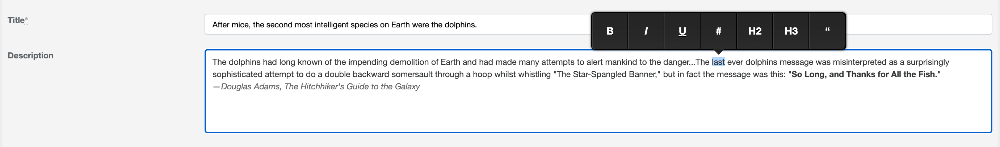

# Active Admin Medium Editor [](https://badge.fury.io/rb/activeadmin_medium_editor) [](https://circleci.com/gh/blocknotes/activeadmin_medium_editor)

An Active Admin plugin to use [medium-editor](https://github.com/yabwe/medium-editor), a compact and clean WYSIWYG editor.



## Usage
- After the installation, select some text in the editor
- A pop-up menu is shown with the available buttons
- Click on a button and the effect will be applied to the selected text

## Install
- After installing Active Admin, add to your Gemfile: `gem 'activeadmin_medium_editor'` (and execute *bundle*)
- Add at the end of your Active Admin styles (_app/assets/stylesheets/active_admin.scss_):
```scss
@import 'activeadmin/medium_editor/medium_editor';
@import 'activeadmin/medium_editor_input';
@import 'activeadmin/medium_editor/themes/default'; // or another theme
```
- Add at the end of your Active Admin javascripts (_app/assets/javascripts/active_admin.js_):
```js
//= require activeadmin/medium_editor/medium_editor
//= require activeadmin/medium_editor_input
```
- Use the input with `as: :medium_editor` in Active Admin model conf

Why 2 separated scripts/styles? In this way you can include a different version of *medium-editor* if you like.

> **UPDATE FROM VERSION < 2.8**: please change your _app/assets/stylesheets/active_admin.scss_ using the new import lines above

## Options
**data-options**: permits to set *medium-editor* options directly - see [options list](https://github.com/yabwe/medium-editor#mediumeditor-options)

## Examples

### Basic usage

```ruby
# Active Admin article form conf:
  form do |f|
    f.inputs 'Article' do
      f.input :title
      f.input :description, as: :medium_editor, input_html: { data: { options: '{"spellcheck":false,"toolbar":{"buttons":["bold","italic","underline","anchor"]}}' } }
      f.input :published
    end
    f.actions
  end
```

### Buttons configuration

```ruby
f.input :description, as: :medium_editor, input_html: { data: { options: '{"spellcheck":false,"toolbar":{"buttons":["bold","italic","underline","anchor","orderedlist","unorderedlist","strikethrough","subscript","superscript","pre","h1","h2","h3","h4","h5","h6","html"]}}' } }
```

## Notes
- With the current version of Medium Editor some default buttons seem to not work properly, from my test they are: "indent", "outdent", "quote", "justifyLeft", "justifyCenter", "justifyRight", "justifyFull"
- If some of this feature are needed I could suggest to override the button behavior or to use custom style classes. See the Medium Editor documentation for details.

## Do you like it? Star it!
If you use this component just star it. A developer is more motivated to improve a project when there is some interest.

Take a look at [other Active Admin components](https://github.com/blocknotes?utf8=✓&tab=repositories&q=activeadmin&type=source) that I made if you are curious.

## Contributors
- [Mattia Roccoberton](http://blocknot.es): author
- The good guys that opened issues and pull requests from time to time

## License
- The gem is available as open-source under the terms of the [MIT](LICENSE.txt)
